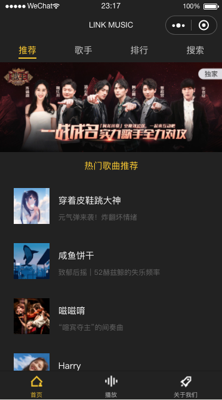
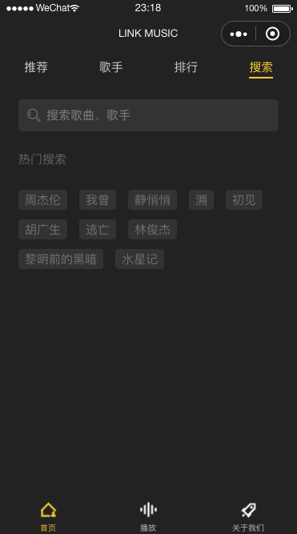
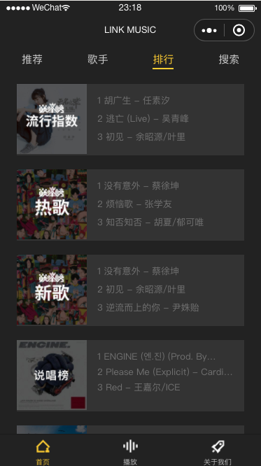
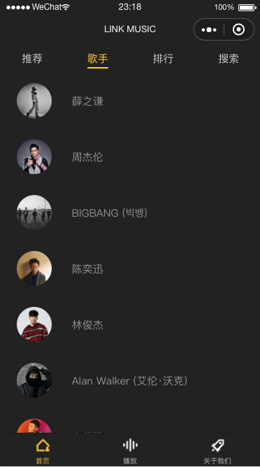
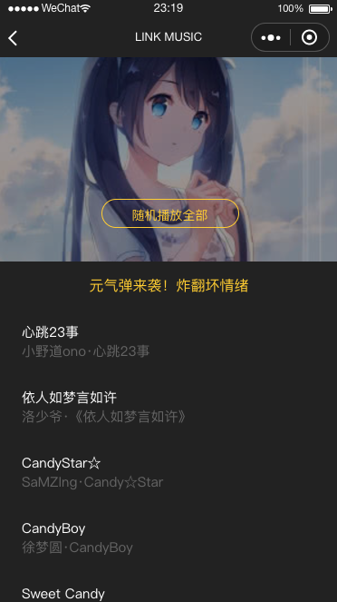
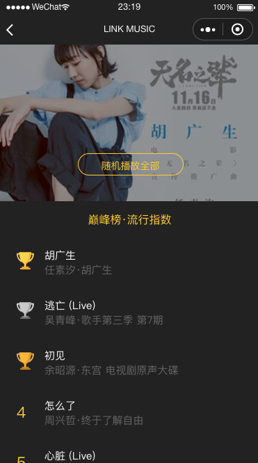
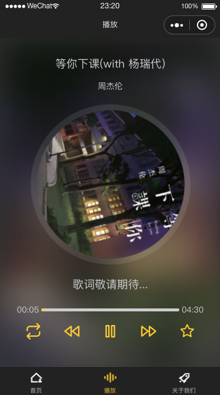
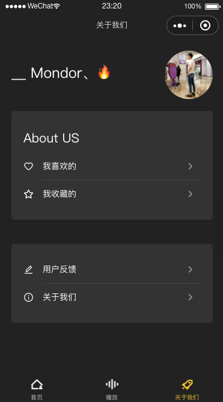

# LINK MUSIC 

## 微信小程序 ( WeChar Applications )

> UI












> files

```
    .
    ├── README.md
    ├── app.js
    ├── app.json
    ├── app.wxss
    ├── lookImg
    │   ├── 1.png
    │   ├── 2.png
    │   ├── 3.png
    │   ├── 4.png
    │   ├── 5.png
    │   ├── 6.png
    │   ├── 7.png
    │   ├── 8.png
    │   └── 9.png
    ├── navBarImages
    │   ├── about-active.png
    │   ├── about.png
    │   ├── index-active.png
    │   ├── index.png
    │   ├── music-active.png
    │   └── music.png
    ├── pages
    │   ├── about
    │   │   ├── about.js
    │   │   ├── about.json
    │   │   ├── about.wxml
    │   │   └── about.wxss
    │   ├── abouts
    │   │   ├── abouts.js
    │   │   ├── abouts.json
    │   │   ├── abouts.wxml
    │   │   └── abouts.wxss
    │   ├── details
    │   │   ├── details.js
    │   │   ├── details.json
    │   │   ├── details.wxml
    │   │   └── details.wxss
    │   ├── feedback
    │   │   ├── feedback.js
    │   │   ├── feedback.json
    │   │   ├── feedback.wxml
    │   │   └── feedback.wxss
    │   ├── images
    │   │   ├── nullimg.png
    │   │   ├── one.png
    │   │   ├── right.svg
    │   │   ├── three.png
    │   │   ├── top.png
    │   │   └── two.png
    │   ├── index
    │   │   ├── index.js
    │   │   ├── index.json
    │   │   ├── index.wxml
    │   │   └── index.wxss
    │   ├── mylike
    │   │   ├── mylike.js
    │   │   ├── mylike.json
    │   │   ├── mylike.wxml
    │   │   └── mylike.wxss
    │   ├── mysc
    │   │   ├── mysc.js
    │   │   ├── mysc.json
    │   │   ├── mysc.wxml
    │   │   └── mysc.wxss
    │   └── play
    │       ├── fonts
    │       │   ├── fonts.wxss
    │       │   ├── iconfont.eot
    │       │   ├── iconfont.js
    │       │   ├── iconfont.svg
    │       │   ├── iconfont.ttf
    │       │   └── iconfont.woff
    │       ├── play.js
    │       ├── play.json
    │       ├── play.wxml
    │       └── play.wxss
    ├── project.config.json
    └── utils
        └── util.js

    14 directories, 65 files

```

Copy right displayli 转载请加备注 或 联系 QQ：463961434
 
Author By displayLi @ [LINK + 创意工作室](http://www.link97.com)
